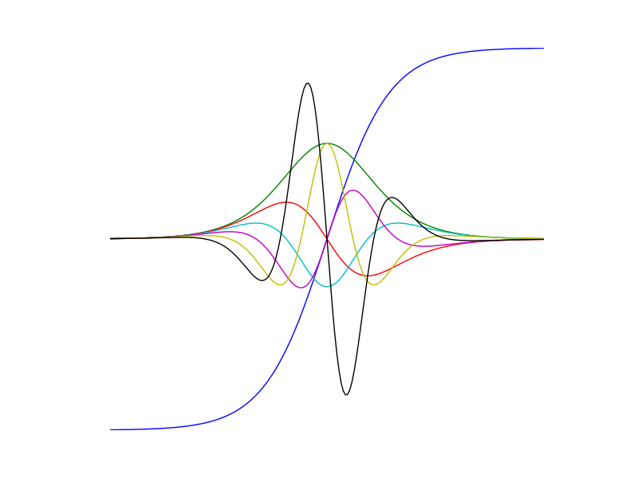

Numdifftools
============

.. image:: https://badge.fury.io/py/numdifftools.png
    :target: https://pypi.python.org/pypi/Numdifftools/

.. image:: https://travis-ci.org/pbrod/numdifftools.svg?branch=master
    :target: https://travis-ci.org/pbrod/numdifftools

.. image:: https://readthedocs.org/projects/pip/badge/?version=latest
    :target: http://numdifftools.readthedocs.org/en/latest/

.. image:: https://landscape.io/github/pbrod/numdifftools/master/landscape.svg?style=flat
   :target: https://landscape.io/github/pbrod/numdifftools/master
   :alt: Code Health

.. image:: https://coveralls.io/repos/pbrod/numdifftools/badge.svg?branch=master
   :target: https://coveralls.io/github/pbrod/numdifftools?branch=master

Numdifftools is a suite of tools written in `_Python <http://www.python.org/>`_ 
to solve automatic numerical differentiation problems in one or more variables.
Finite differences are used in an adaptive manner, coupled with a Richardson 
extrapolation methodology to provide a maximally accurate result.
The user can configure many options like; changing the order of the method or
the extrapolation, even allowing the user to specify whether complex-step, central, 
forward or backward differences are used.

The methods provided are:

- **Derivative**: Compute the derivatives of order 1 through 10 on any scalar function.

- **Gradient**: Compute the gradient vector of a scalar function of one or more variables.

- **Jacobian**: Compute the Jacobian matrix of a vector valued function of one or more variables.

- **Hessian**: Compute the Hessian matrix of all 2nd partial derivatives of a scalar function of one or more variables.

- **Hessdiag**: Compute only the diagonal elements of the Hessian matrix 

All of these methods also produce error estimates on the result.

Numdifftools also provide an easy to use interface to derivatives calculated
with in `_AlgoPy <https://pythonhosted.org/algopy/>`_. Algopy stands for Algorithmic
Differentiation in Python.
The purpose of AlgoPy is the evaluation of higher-order derivatives in the
`forward` and `reverse` mode of Algorithmic Differentiation (AD) of functions
that are implemented as Python programs.

Getting Started
---------------

Visualize high order derivatives of the tanh function

    >>> import numpy as np
    >>> import numdifftools as nd
    >>> import matplotlib.pyplot as plt
    >>> x = np.linspace(-2, 2, 100)
    >>> for i in range(10):
    ...    df = Derivative(np.tanh, n=i)
    ...    y = df(x)
    ...    plt.plot(x, y/np.abs(y).max())
    >>> plt.show()

Compute 1'st and 2'nd derivative of exp(x), at x == 1::

    >>> fd = nd.Derivative(np.exp)        # 1'st derivative
    >>> fdd = nd.Derivative(np.exp, n=2)  # 2'nd derivative
    >>> np.allclose(fd(1), 2.7182818284590424)
    True
    >>> np.allclose(fdd(1), 2.7182818284590424)
    True

Nonlinear least squares::

    >>> xdata = np.reshape(np.arange(0,1,0.1),(-1,1))
    >>> ydata = 1+2*np.exp(0.75*xdata)
    >>> fun = lambda c: (c[0]+c[1]*np.exp(c[2]*xdata) - ydata)**2
    >>> Jfun = nd.Jacobian(fun)
    >>> np.allclose(np.abs(Jfun([1,2,0.75])), 0) # should be numerically zero
    True

Compute gradient of sum(x**2)::

    >>> fun = lambda x: np.sum(x**2)
    >>> dfun = nd.Gradient(fun)
    >>> dfun([1,2,3])
    array([ 2.,  4.,  6.])

Compute the same with the easy to use interface to AlgoPy::

    >>> import numdifftools.nd_algopy as nda
    >>> import numpy as np
    >>> fd = nda.Derivative(np.exp)        # 1'st derivative
    >>> fdd = nda.Derivative(np.exp, n=2)  # 2'nd derivative
    >>> np.allclose(fd(1), 2.7182818284590424)
    True
    >>> np.allclose(fdd(1), 2.7182818284590424)
    True

Nonlinear least squares::

    >>> xdata = np.reshape(np.arange(0,1,0.1),(-1,1))
    >>> ydata = 1+2*np.exp(0.75*xdata)
    >>> fun = lambda c: (c[0]+c[1]*np.exp(c[2]*xdata) - ydata)**2
    >>> Jfun = nda.Jacobian(fun, method='reverse')
    >>> np.allclose(np.abs(Jfun([1,2,0.75])), 0) # should be numerically zero
    True

Compute gradient of sum(x**2)::

    >>> fun = lambda x: np.sum(x**2)
    >>> dfun = nda.Gradient(fun)
    >>> dfun([1,2,3])
    array([ 2.,  4.,  6.])

See also
--------
scipy.misc.derivative

Documentation and code
======================

Numdifftools works on Python 2.7+ and Python 3.0+.

Official releases available at: http://pypi.python.org/pypi/numdifftools

.. image:: https://badge.fury.io/py/numdifftools.png
    :target: https://pypi.python.org/pypi/Numdifftools/

Official documentation available at: http://numdifftools.readthedocs.org/

.. image:: https://readthedocs.org/projects/pip/badge/?version=latest
    :target: http://numdifftools.readthedocs.org/en/latest/

Bleeding edge: https://github.com/pbrod/numdifftools.

Installation and upgrade:
=========================

with pip

$ pip install numdifftools

with easy_install

$ easy_install numdifftools for installation

$ easy_install upgrade numdifftools to upgrade to the newest version

Unit tests
==========
To test if the toolbox is working paste the following in an interactive
python session::

   import numdifftools as nd
   nd.test(coverage=True, doctests=True)

